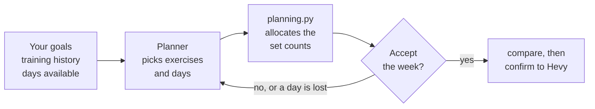

# Fitness ledger

A personal training tracker. It counts your **effective sets per muscle group
each week** and compares them against a target, and it tracks your running the
same way — so you can see when one is quietly eating into the other.

An *effective set* is a working set, warmups excluded. The muscle doing the work
gets full credit; muscles assisting get half.

Lifting data comes from Hevy. Runs, sleep and resting heart rate come from
Google Health. It can also draft next week's training for you to approve.

## What it does

- **Tracks volume per muscle group.** Effective sets per week against a target.
- **Answers questions about your training.** How much chest work did I do last
  week? What am I neglecting? Is my running getting more efficient?
- **Measures running efficiency.** The Aerobic Efficiency Index adjusts distance
  for hills, then divides by heartbeats, so a hilly run and a flat one of
  similar length compare fairly.
- **Drafts your week.** A planner proposes sessions from your goals, what you've
  actually been doing, and which days you have free. It also says what it
  couldn't fit in.
- **Never changes anything on its own.** Warnings are shown, not acted on.
  Sending a workout to Hevy needs you to confirm it against a before/after
  comparison.

All the maths happens in a rules engine that is plain Python with no database or
network access, so every number is testable and the command line and dashboard
can't disagree. The model, where one is used at all, never does arithmetic — it
picks which function to call and describes the result.

## Before you start

Setting this up takes **30–45 minutes**, mostly Google's OAuth flow.

| | |
|---|---|
| **Python** | 3.11 or newer |
| **Node** | 20 or newer — required to run the Google Health server, and to change the frontend |
| **Hevy account** | **Pro subscription.** The API key is a Pro-only feature, generated at [hevy.com/settings?developer](https://hevy.com/settings?developer) |
| **Google account** | with data in Google Health/Fit |
| **Model provider** | optional — only `ask` and `plan` need one |

Your data arrives through two small servers that run on your own machine. Each
one holds its own credentials, which is why none live in this repo. **Both are
worth setting up**: without the Hevy server there is no lifting data, so
`volume`, `progress` and the Gym tab are empty; without the Google Health server
there are no runs, sleep or efficiency scores.

Clone and build each one, following its own README:

| Server | Gives you | Needs |
|---|---|---|
| [hevy-mcp](https://github.com/visakhr1998/hevy-mcp) | lifting history | Hevy API key, in its own `.env` |
| [google-health-mcp-v1](https://github.com/visakhr1998/google-health-mcp-v1) | runs, sleep, resting HR | Google OAuth token, in its own token file |

Then point this app at them in your `.env`. The two look different because one
is an executable and the other is a script you run with Node:

```ini
HEVY_MCP_COMMAND=/absolute/path/to/hevy-mcp
HEVY_MCP_ENV=HEVY_DOTENV=/absolute/path/to/hevy-mcp/.env

HEALTH_MCP_COMMAND=node
HEALTH_MCP_ARGS=/absolute/path/to/google-health-mcp-server/dist/index.js
HEALTH_MCP_ENV=GOOGLE_HEALTH_TOKEN_PATH=/absolute/path/to/token.json
```

Use absolute paths, and note the health server must be **built** first — the
path points at `dist/index.js`, not the source.

## Install

```bash
git clone https://github.com/visakhr1998/fitness_ledger.git
cd fitness_ledger

python -m venv .venv
source .venv/bin/activate        # macOS / Linux
# .venv\Scripts\activate         # Windows

pip install -e ".[dev]"
cp .env.example .env             # then fill in the paths above
```

Activating the venv puts a `ledger` command on your path — that's what the rest
of this page uses.

Week planning is a separate install, because it pulls in around 120 packages
that nothing else needs:

```bash
pip install -e ".[coach]"
```

## First run

```bash
ledger doctor     # can it reach both servers?
ledger sync       # download your history
ledger serve      # dashboard on http://localhost:8000
```

`doctor` is what to run whenever something looks wrong. Working output looks
roughly like this:

```
Hevy MCP           ok    12 tools
Google Health MCP  ok    9 tools
Database           474 workouts, 85 nights of sleep, 12 runs
Model provider     gemini (gemini-3.6-flash)
```

The first `sync` downloads everything — around 48 requests for ~474 workouts,
so a few minutes. After that it only fetches what's new.

Sensible per-muscle targets are already set, so `ledger volume` works
immediately. Adjust them with `ledger targets --set chest=16`. Set some goals
with `ledger goals --add` before your first `ledger plan`.

## Drafting a week



The planner chooses exercises and days. It never chooses how many sets — that
comes from your weekly targets. Accepting a week only records it here; sending a
day to Hevy is a separate step where you see exactly what will be created before
anything happens.

## Commands

| Command | What it tells you |
|---|---|
| `volume [--window]` | Every muscle group against its target |
| `muscle <name> [--window]` | How much you did for one muscle group |
| `neglected [--window]` | What you've been skipping |
| `trend [--weeks] [--muscle]` | Volume over time |
| `progress <exercise>` | Estimated one-rep max over time |
| `progression` | Whether each lift is ready for more weight |
| `runs` · `health` | Runs; sleep, resting HR, steps |
| `insights` | Run the warning rules |
| `plan [--week]` | Draft a week — *needs the coach install and a model provider* |
| `unavailable <date>` | Mark a day you can't train, then draft again |
| `goals [--add strength_1rm=100] [--set-running 25/3]` | Show or set goals and a weekly running target |
| `targets [--set chest=16]` | Show or change per-muscle targets |
| `exercises <query>` | Search the exercise catalog |
| `ask "<question>"` | Ask in plain English — *needs a model provider* |
| `export [--out]` | Dump every table to JSON |

Everything except `ask` and `plan` works with no model provider configured.

Time windows accept `this-week`, `last-week`, `last-4-weeks`, `last-30-days`,
`last-3-months`, `2026-07`, or `2026-07-01:2026-07-31`. Two of those forms are
not interchangeable: `last-N-weeks` counts only finished weeks, while
`last-N-days` includes today. See
[volume and progression](docs/volume-and-progression.md#two-kinds-of-time-window).

## When it doesn't work

| Symptom | Usually means |
|---|---|
| `doctor` can't reach Hevy | `HEVY_MCP_COMMAND` isn't an absolute path, or isn't executable |
| `doctor` can't reach Google Health | The server isn't built — `HEALTH_MCP_ARGS` must point at `dist/index.js` |
| Google Health worked, now doesn't | The OAuth token expired; re-run that server's auth flow |
| Chat box says no provider | Set `GEMINI_API_KEY`, or `LLM_PROVIDER=ollama` to run locally |
| `plan` fails on a 404 | `GEMINI_MODEL` is unset and defaulting to a retired model — set it explicitly |
| Empty Gym tab after sync | Sync ran, but Hevy returned nothing — check the API key is Pro-active |

## Documentation

| | |
|---|---|
| [Volume and progression](docs/volume-and-progression.md) | How sets are counted, time windows, adding weight, warning rules |
| [Aerobic Efficiency Index](docs/aerobic-efficiency-index.md) | The running metric and how it's calculated |
| [Architecture](docs/architecture.md) | Code layout, the planner, API reference, data quirks |
| [Model providers](docs/model-providers.md) | Gemini, Ollama, Anthropic or anything OpenAI-compatible |

## Privacy

No credentials live in this repo — the two servers hold their own, and `.env`
here holds paths and settings only. `data/` is git-ignored because the database
contains your training history. If you enable the chat box on a hosted model,
your questions and training numbers go to that provider; `ollama` keeps
everything local. See [SECURITY.md](SECURITY.md) and
[model providers](docs/model-providers.md).

## What this isn't

- **Not automatic.** Nothing reaches Hevy without you confirming it first. Hevy
  has no delete endpoint, so anything written has to be removed by hand in the
  app.
- **Not medical advice.** Sleep and heart-rate data are shown as your own
  history, never as a recommendation.
- **Not multi-user.** One person, no accounts. Share it by cloning it and
  pointing it at your own data.

## Contributing

```bash
pytest                            # 455 tests, or 466 with the coach extra
cd frontend && npm install && npm test
```

The coach's evaluation tests are skipped by default because they cost real model
requests. Turn them on with `RUN_COACH_EVALS=1`.

The tracker, dashboard, running metric, Hevy write-back and the planner are all
done. Still to come: comparing what you planned against what you actually did,
and hosting it somewhere with scheduled planning.

## Licence

MIT. See [LICENSE](LICENSE).
