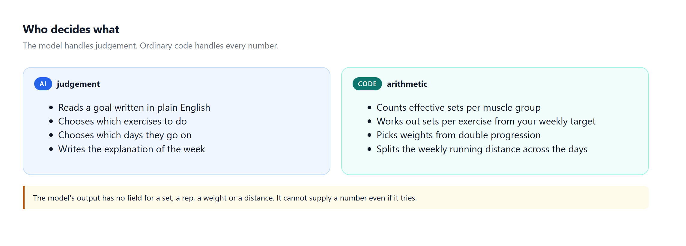
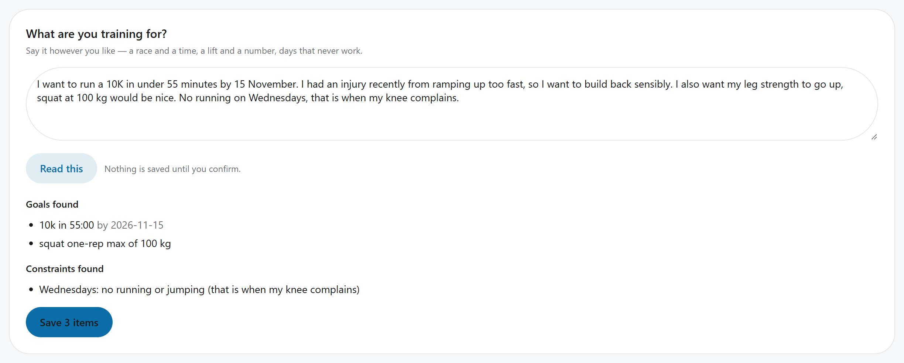
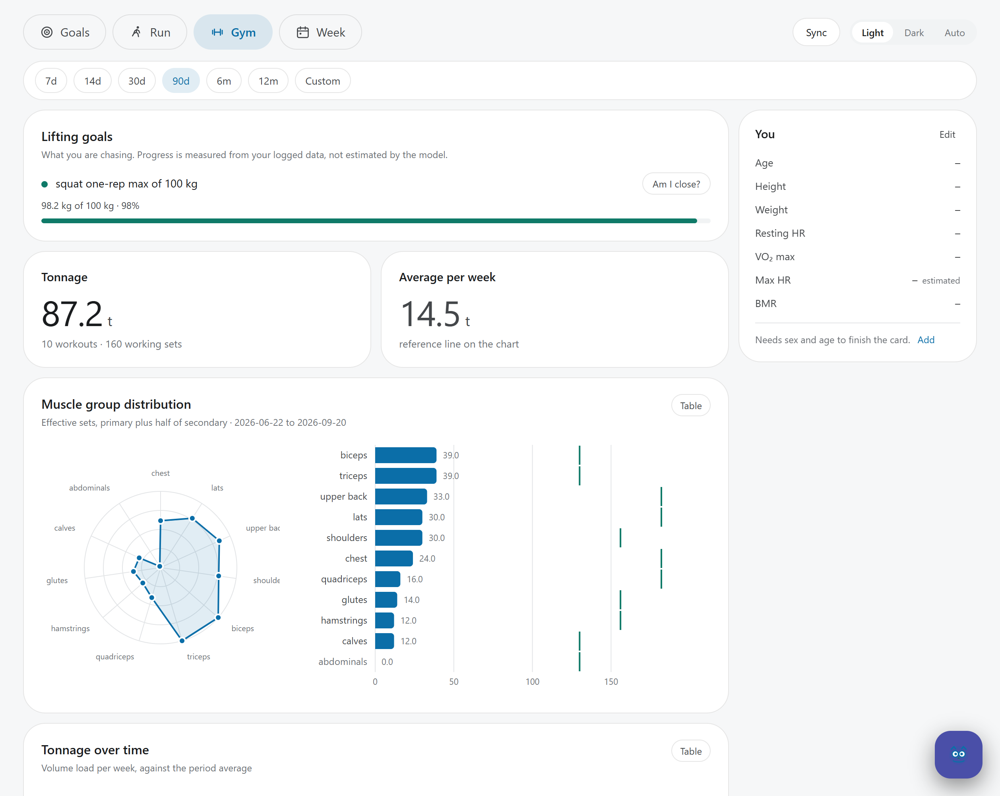
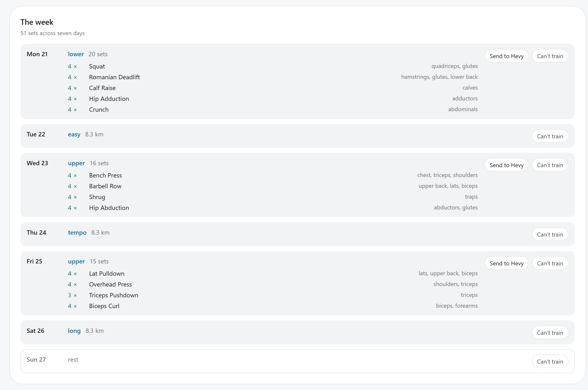
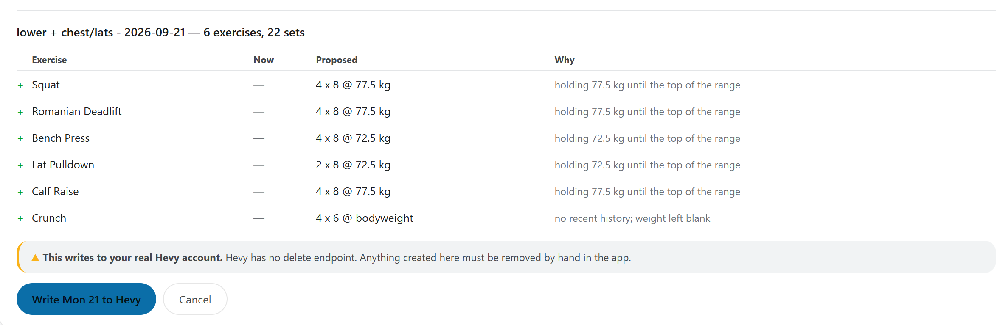

# Fitness ledger

A training planner for people who both lift and run. It reads your real
training history, tracks each muscle group and your running against weekly
targets, and drafts next week's plan with AI. Every number in that plan comes
from plain, tested code, not from the model.

Built by one runner after an injury. The full story is in
[How a running injury led me down an Agentic AI rabbit hole](https://medium.com/@b00791189/how-a-running-injury-led-me-down-an-agentic-ai-rabbit-hole-c883c2091dd5).

## Why this exists

In June 2026 I decided an easy 10K was a reasonable goal, trained alongside my
usual lifting, felt fine, and kept adding more. Then I got injured. The cause
was the oldest one in running: too much, too soon.

The obvious fix was to ask an AI for a plan. Chatbots will happily write one,
but the plans tend to be:

- **over-ambitious**, with no sense of when to push and when to back off;
- **overloaded**, with so many exercises that the fatigue outweighs the benefit;
- **disconnected** from what you actually did last week, because the chatbot
  can't see your training.

This project fixes the last problem by connecting to the apps where the
training already lives, and the first two by splitting the work.

## The idea: AI for judgement, code for numbers



- **The AI** reads goals written in plain English, chooses exercises and
  training days, and explains the week.
- **Plain code** does the arithmetic: counting sets per muscle group, working
  out how many sets each exercise gets, picking weights and splitting your
  weekly running distance.

The AI's output has no field for a set, a rep, a weight or a distance, so it
cannot slip a made-up number into your plan. The code is covered by unit
tests, so the same history always gives the same numbers.

## How it works

Your data comes from two apps: **Hevy** for lifting and **Google Health** (Fitbit)
for runs, sleep and heart rate. Two small connectors
([MCP servers](https://modelcontextprotocol.io/)) copy it into a database on
your computer, and a dashboard shows it.

### 1. Say what you want, in your own words



Type your goals the way you'd say them. The app turns them into structured
goals, weekly rules (like "no running on Wednesdays") and days off, and shows
you the result. Nothing is saved until you confirm.

### 2. See both halves of your training in one place



The **Gym** and **Run** screens show where you stand. Goal progress is measured
from your logged data. Sets are counted per muscle group against a weekly target,
and runs are compared by efficiency (distance adjusted for hills, per
heartbeat). A chat box answers questions such as "how much chest did I do last
week?" by looking the numbers up rather than guessing.

### 3. Get next week drafted



A small team of AI agents plans the week, built with Google's
[Agent Development Kit (ADK)](https://google.github.io/adk-docs/):

1. **Context reader.** Not an AI; it just reads your goals, rules, free days and
   history from the database.
2. **Strength planner.** Chooses the lifting sessions.
3. **Running planner.** Places the runs around them.

The code then works out every set count and checks the draft against the rules:
rest days between sessions for the same muscle, no run the day after legs, and
your weekly rules. A draft that breaks one is sent back to be redone. After a
break from training, the targets start lower and build back up.

### 4. Life happens? Lose a day and plan again

Mark a day as unavailable and the whole pipeline runs again, fitting the week
around the gap and saying what it had to give up.

### 5. Send it to your phone



Send a day to Hevy and you'll see exactly what will be created first. Nothing is
written until you confirm, because Hevy has no delete button in its API.

## Getting started

### What you need

- A **Hevy Pro** subscription. The API key is Pro-only and is generated at
  [hevy.com/settings?developer](https://hevy.com/settings?developer).
- A Google account with data in Google Health or Google Fit.
- Python 3.11 or later, Node.js 20 or later, and git.
- About an hour, and some comfort running commands in a terminal.

### 1. Build the two connectors

These are separate projects. Follow each one's README, then note the full paths
to the files listed below. A short path without spaces, such as `C:\ledger\` or
`~/ledger/`, makes the next steps easier.

| Repository | Provides | You end up with |
|---|---|---|
| [hevy-mcp](https://github.com/visakhr1998/hevy-mcp) | Lifting history | An executable, and a `.env` file with your Hevy API key |
| [google-health-mcp-v1](https://github.com/visakhr1998/google-health-mcp-v1) | Runs, sleep, heart rate | A built `dist/index.js`, and a token file from signing in to Google |

### 2. Install the ledger

Windows (PowerShell):

```powershell
git clone https://github.com/visakhr1998/fitness_ledger.git
cd fitness_ledger
python -m venv .venv
.venv\Scripts\Activate.ps1
pip install -e .
Copy-Item .env.example .env
```

If PowerShell says running scripts is disabled, run
`Set-ExecutionPolicy -Scope CurrentUser RemoteSigned` once and try again.

macOS and Linux:

```bash
git clone https://github.com/visakhr1998/fitness_ledger.git
cd fitness_ledger
python -m venv .venv
source .venv/bin/activate
pip install -e .
cp .env.example .env
```

When your prompt starts with `(.venv)`, the `ledger` command is ready.

The weekly planner is an optional extra, because it adds roughly 118 packages:

```bash
pip install -e ".[coach]"
```

### 3. Point it at the connectors

Open `.env` and fill in the paths from step 1:

```ini
# Windows
HEVY_MCP_COMMAND=C:\ledger\hevy-mcp\hevy-mcp.exe
HEVY_MCP_ENV=HEVY_DOTENV=C:\ledger\hevy-mcp\.env
HEALTH_MCP_COMMAND=node
HEALTH_MCP_ARGS=C:\ledger\google-health-mcp-v1\dist\index.js
HEALTH_MCP_ENV=GOOGLE_HEALTH_TOKEN_PATH=C:\ledger\google-health-mcp-v1\token.json

# macOS / Linux
HEVY_MCP_COMMAND=/Users/you/ledger/hevy-mcp/hevy-mcp
HEVY_MCP_ENV=HEVY_DOTENV=/Users/you/ledger/hevy-mcp/.env
HEALTH_MCP_COMMAND=node
HEALTH_MCP_ARGS=/Users/you/ledger/google-health-mcp-v1/dist/index.js
HEALTH_MCP_ENV=GOOGLE_HEALTH_TOKEN_PATH=/Users/you/ledger/google-health-mcp-v1/token.json
```

Also set `LOCAL_UTC_OFFSET_MINUTES` to your time zone's offset in minutes (60
for UK summer time, 120 for central Europe, -300 for US Eastern). It decides
which day a late-evening workout counts for.

### 4. Check, sync and open

```bash
ledger doctor   # checks both connectors
ledger sync     # copies your history; a few minutes the first time
ledger serve    # then open http://localhost:8000
```

`doctor` should show `OK` for both connectors. Zero workouts before the first
sync is normal, and so is "NO PROVIDER": the AI features are optional.

Keep the `ledger serve` window open while you use the dashboard.

### 5. Turn on the AI features (optional)

The Goals box, chat box and planner need a language model. The easiest option
is a free Gemini key from [Google AI Studio](https://aistudio.google.com/apikey):
put it in `.env` as `GEMINI_API_KEY`. To keep everything on your computer, run
a local model with `LLM_PROVIDER=ollama` instead. See
[Model providers](docs/model-providers.md) for all options.

## Using it day to day

Each time you open a new terminal:

```bash
cd path/to/fitness_ledger
.venv\Scripts\Activate.ps1     # Windows
source .venv/bin/activate      # macOS / Linux
ledger serve
```

Most things happen in the dashboard, which has four screens: **Goals**,
**Run**, **Gym** and **Week**. Everything is also available from the command
line.

<details>
<summary>Command reference</summary>

| Command | Description |
|---|---|
| `doctor` | Check the connectors, database and model provider |
| `sync [--weeks] [--full]` | Fetch new data from Hevy and Google Health |
| `serve` | Start the dashboard on port 8000 |
| `volume [--window]` | Every muscle group against its target |
| `muscle <name> [--window]` | Volume for one muscle group |
| `neglected [--window]` | Muscle groups furthest below target |
| `trend [--weeks] [--muscle]` | Weekly volume over time |
| `progress <exercise>` | Estimated one-rep max over time |
| `progression` | Whether each lift is ready for more weight |
| `runs`, `health` | Runs; sleep, resting heart rate and steps |
| `insights` | Run the warning rules |
| `targets [--set chest=16]` | Show or change weekly targets |
| `exercises <query>` | Search the exercise catalog |
| `unavailable <date>` | Mark a day you can't train |
| `export [--out]` | Export everything to JSON |
| `ask "how much chest did I do last week?"` | Ask a question (needs a model) |
| `goals --add strength_1rm=100 --subject "Bench Press"` | Add a one-rep-max goal |
| `goals --add reps=10 --subject "Pull Up"` | Add a rep goal |
| `goals --set-running 25/3` | Run 25 km a week over 3 runs |
| `plan [--week]` | Draft a week (needs a model and the `coach` extra) |

Time windows accept `this-week`, `last-week`, `last-4-weeks`, `last-30-days`,
`last-3-months`, `2026-07`, or a range such as `2026-07-01:2026-07-31`.
`last-N-weeks` counts only completed weeks, while `last-N-days` includes today.

</details>

## Troubleshooting

| Problem | Likely cause |
|---|---|
| `ledger: command not found` | The virtual environment isn't active. See [Using it day to day](#using-it-day-to-day). |
| PowerShell says running scripts is disabled | Run `Set-ExecutionPolicy -Scope CurrentUser RemoteSigned` once. |
| `doctor` can't reach Hevy | `HEVY_MCP_COMMAND` isn't a full path, or the file isn't executable. |
| `doctor` can't reach Google Health | The connector isn't built. `HEALTH_MCP_ARGS` must point to `dist/index.js`. |
| Google Health stopped working | The sign-in has expired. Sign in again through the connector. |
| The Gym screen is empty after a sync | Hevy returned no data. Check that the API key belongs to a Pro account. |
| Workouts show up on the wrong day | `LOCAL_UTC_OFFSET_MINUTES` is wrong. See [step 3](#3-point-it-at-the-connectors). |

## Your data

- Everything is stored on your computer, in `data/`, which is never committed.
- No passwords or API keys are stored in this repository. The two connectors
  keep their own.
- If you use a hosted AI model, your training figures and anything you type into
  the app are sent to that provider. With `ollama`, nothing leaves your machine.
- Nothing is written to Hevy without your confirmation.
- Sleep and heart-rate data are shown as your own history, never as medical
  advice.

This is a single-person app: to use it, clone it and point it at your own data.
See [SECURITY.md](SECURITY.md) for details.

## Learn more

- [How the numbers work](docs/how-it-works.md): effective sets, progression,
  goal progress, planning rules, warnings and running efficiency.
- [Model providers](docs/model-providers.md): choosing and configuring the AI.
- [Architecture](docs/architecture.md): how the code fits together.
- [Contributing](CONTRIBUTING.md)
- [The article](https://medium.com/@b00791189/how-a-running-injury-led-me-down-an-agentic-ai-rabbit-hole-c883c2091dd5):
  the story behind the project, and what it took to make an AI planner
  trustworthy.

## Licence

MIT. See [LICENSE](LICENSE).
